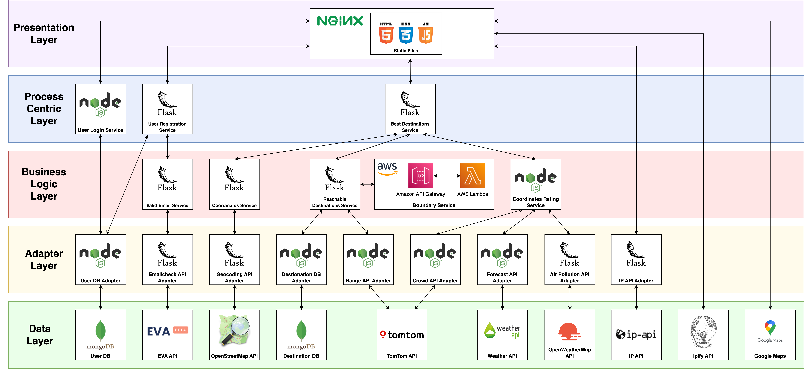

# Daytrip
## A service-oriented web application for inspiring daytrips in Italy


This project aims to create a web application that suggests daytrip destinations in Italy based on weather conditions, travel time, and other indicators. A service-oriented architecture was used to build decoupled services that can be expanded and modified independently.

## Endpoints documentation

Documentation of the endpoints can be found on Apiary at the following link: https://daytrip1.docs.apiary.io/

## Architecture Diagram




## How to run

To run the application, you need to have Docker and Docker Compose installed. 

For newer versions of Docker, on MacOS, you need to run, otherwise the docker-compose command will fail:
```bash
sudo chown -R $(whoami) ~/.docker
```

 Then, run the following command in the root directory of the project:

```bash
docker-compose up --build
```

## How to test protected routes

1. Create ADMIN user using the POST /users endpoint (http://localhost:6868/api/v1/users/) and not on the /users/signup with a body of the following shape:
```json
{
  "name": "Leonardo",
  "surname": "Vicentini",
  "email": "vicentini.leonardo99@gmail.com",
  "password": "123",
  "status": "ADMIN",
  "origin_name": "Povo (TN)",
  "origin_coordinates": {
      "lat": 46.06,
      "lon": 11.15
  }
}
```

2. Login with the ADMIN user using the POST /users/sessions endpoint (http://localhost:6882/api/v1/sessions) with a body of the following shape:
```json
{
    "email": "vicentini.leonardo99@gmail.com",
    "password": "123"
}
```

3. Copy the token from the response and paste it in the **Authorization header** of the protected routes, using the Bearer schema. 
Like:
Key: Authorization
Value: Bearer <token>

4. For instance, to load all the destinations use the following: 
POST http://localhost:6869/api/v1/destinations/bulk, making sure to have the Authorization header set as described above.


## Features

+ Suggests ranked list of daytrip destinations based on weather, travel time, crowdedness, and other indicators
+ Uses both internal and external data sources to provide recommendations
+ Scalable service-oriented architecture that can easily incorporate new ranking indicators
+ Docker Compose used to deploy the multi-container application
+ REST APIs built to represent data resources


## Architecture

The architecture is divided into 4 layers:

1. **Data layer** - Contains databases and services for external data
2. **Adapter layer** - Standardizes data from external APIs
3. **Business logic layer** - Calculates ratings and performs business logic
4. **Process centric layer** - Provides high level functionality to end users

In total, 25 services were built across the 4 layers. Docker Compose is used to define and deploy the multi-container application.

## Technologies

+    

 
 


## External sources

The project leverages a number of external data sources to provide recommendations:

+ TomTom APIs - Used to calculate reachable ranges based on travel time and vehicle, and to determine crowdedness based on traffic flow data. 

+ Weather APIs - Weather API and OpenWeatherMap API are used to gather data on temperature, precipitation, wind, and air quality. This provides important indicators for recommending daytrip destinations.

+ Geocoding APIs - OpenStreetMap, and Google Maps APIs are used to convert between addresses and geographic coordinates, which is necessary to determine distances and travel times.

+ IP geocoding APIs - ip-api and ipify APIs are used to determine the user's origin location based on their IP address. This is used as the starting point for destination recommendations.

+ Email validation API - EVA API is used to validate user emails during registration to ensure they are real email addresses.

## Response structure

JSON specification used: JSend specification (https://github.com/omniti-labs/jsend)

```json
{
  "status": "success",
  "message": "User found",
  "data": 
  {
    "user": {
      "id": "60f9b9b0e3c6b8a2b4b1f1f1",
      "name": "John Doe",
      "email": "" 
    }
  }
}
```
  
```json
{
  "status": "success",
  "message": "Users found",
  "data": {
    "users": [
      {
        "id": "60f9b9b0b9b9b9b9b9b9b9b9",
        "name": "John Doe",
        "email": ""
      },
      {
        "id": "456w232323",
        "name": "Jane Smith",
        "email": ""
      }
    ]
  }
}

```
Fail
When an API call is rejected due to invalid data or call conditions, the JSend object's data key contains an object explaining what went wrong, typically a hash of validation errors. For example:

```json
{
  "status": "fail",
  "data": { "lon" : "lon is required" }
}
```

Error
When an API call fails due to an error on the server. For example:

```json
{
  "status": "error",
  "code": 500,
  "message": "Unable to communicate with database"
}
```

## Future improvements

+ API caching: https://www.npmjs.com/package/apicache middleware (on its own or with Redis)

+ Service Registry and Discovery in a more structured way


## Acknowledgements

+ Node.js + Mongoose skeleton template: https://github.com/bezkoder

+ JSend specification: https://github.com/omniti-labs/jsend

+ GeoCoding (Nominatim): © OpenStreetMap

+ Nominatim self-hosted as a docker container (Discarded idea, oot used, too slow startup for the demo test of the project): https://github.com/mediagis/nominatim-docker

+ Layers for AWS Lambda function: https://github.com/keithrozario/Klayers
